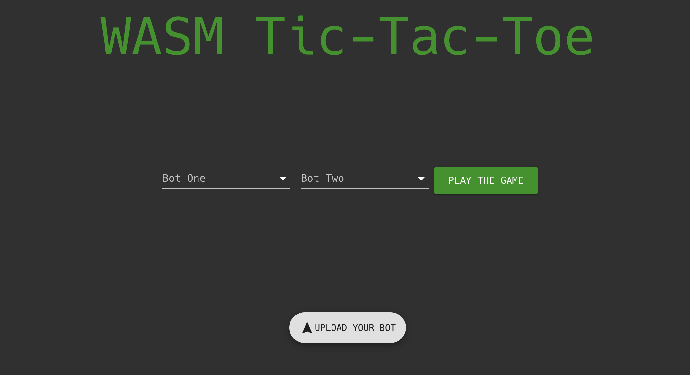
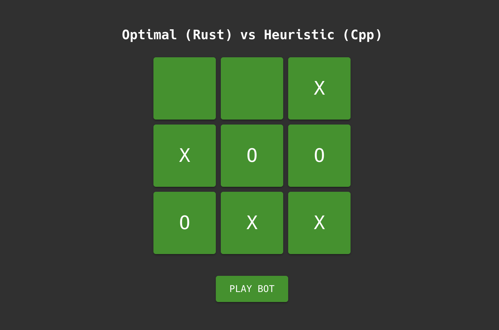

# WebAssembly Sandbox Demo
This is a demo created to showcase the security and sandbox execution of [WebAssembly](https://webassembly.org/). It is a basic TicTacToe website where any user is allowed to upload code compiled to WASM that implements a bot that plays TicTacToe. Due to the built in sandboxing of WebAssembly this is safe.

To find out more you can read our [**report here**](./report.pdf). This was done as a project in the course [DD2525 Language-Based Security](https://www.kth.se/student/kurser/kurs/DD2525?l=en) at KTH.





# Running locally
## The backend
The backend is hosted in a [Docker](https://www.docker.com/) container. It requires docker to be installed on your system. Once it is you can start the backend by running the following commands.

```sh
$ cd backend
$ docker-compose up
```

## The frontend
The frontend is a [Create React App](https://reactjs.org/docs/create-a-new-react-app.html) application. Before running it you need to install the required dependencies via `npm install`. You can run the frontend server via the following commands.

```sh
$ cd frontend
$ npm install
$ npm start
```

# Deploying to Heroku
See [HerokuDeployment.md](./HerokuDeployment.md) for how to deploy this app to Heroku, a cloud hosting platform.
